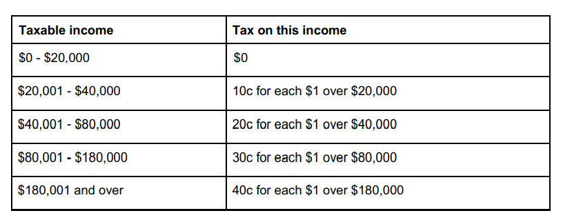
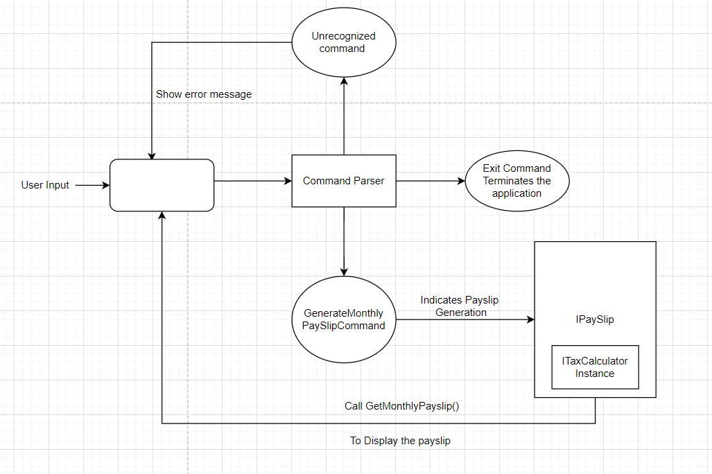
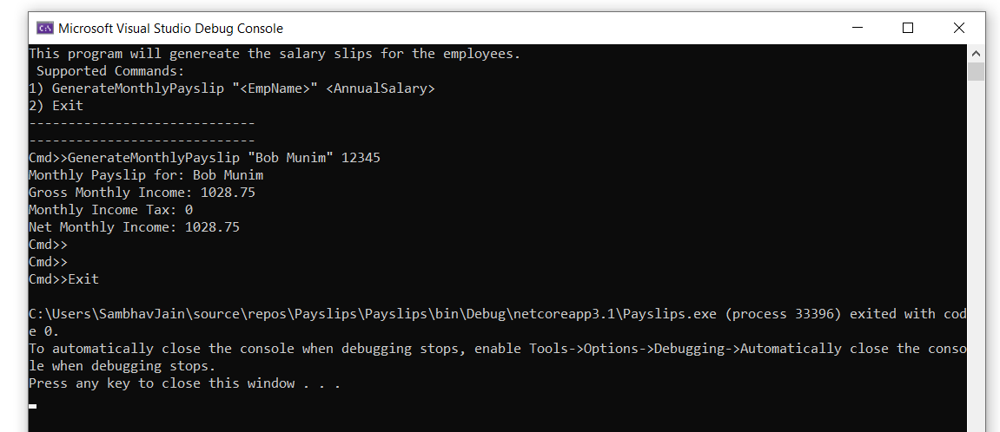

# Payslips

Payslip is a console application that generates the monthly 
salary slip of an employee given its annual salary.

The follwoing annual tax rates apply:

 This program Supports follwong  Commands:
1) **GenerateMonthlyPayslip \"\<EmpName\>\" \<AnnualSalary\>**

    This command will generate the monthly salary slip of an employee.

2) **Exit**

    This command will terminate the program.

## Assumption

  As the problem statment is quite broad and have some open gaps, I have made following assumptions:
* Provided slabs have some range not defined. For example for first two slabs do not cover range 20000 to 20001.
 So this program will calculate the tax on the provided slabs range leaving ranges like
 20000 to 20001 , 40000 to 40001 etc.

* GenerateMonthlyPayslip will accept the employee name in quotes "<EmpName>". This has been done to match the problem statement.
* Emplyees model is not implemented as it is not required to implement PaySlip functionality.

## Application Flow

- User will input a command.
- If command is not valid then an error message will be displayed.
- If command is EXIT then program will terminate gracefully.
- if Command is GenerateMonthly Payslip with required arguments then an instance of Payslip
  will be instantiated. Payslip has tax calculator that will calculate the tax.
- PaySlip GetMonthlyPayslip will display the generated payslip on console. 
 

## Instruction to complie the code
IMPROVE IT
This application required framework **'Microsoft.NETCore.App', version '3.1.0'**.

- **Linux Environment**
    * Execute BuildNRun.sh in a bash shell to compile and run the application.
    
      > [./BuildNRun.sh](https://github.com/samjaing/Payslips/blob/master/BuildNRun.sh)
    
- **Windows Environment**
  * Execute the BuildNRun.bat file to compile the run the application.
      > [.\BuildNRun.bat](https://github.com/samjaing/Payslips/blob/master/BuildNRun.bat)
      

## Sample Execution

User has generated Payslip for an employee using command GenerateMonthlyPayslip and then exit the program using EXIT command.

## Improvements Required

There is always a better way.
This repository code can be improved in following ways:

1) Use **System.CommandLine** to handle the command in a better way.
2) Use **Dependency injection** to instantiate the ITaxCalculator.
3) Provide a **json file** with tax slabs information so that user can use a different set of tax slab.

